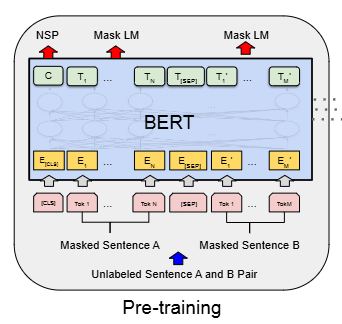

# BERT

- [BERT](#bert)
  - [Overview](#overview)
  - [Architecture](#architecture)
    - [Multi-head attention](#multi-head-attention)
    - [Parameter Calculation](#parameter-calculation)
    - [Input/Output Representation](#inputoutput-representation)
  - [Pre-training BERT](#pre-training-bert)
    - [Masked LM](#masked-lm)
    - [Next Sentence Prediction(NSP)](#next-sentence-predictionnsp)
    - [Pre-training data](#pre-training-data)
  - [Fine-tuning BERT](#fine-tuning-bert)
    - [GLUE](#glue)
    - [SQuAD](#squad)
  - [Reference](#reference)

## Overview

Bidirectional Encoder Representations from Transformers. It is designed to pretrain deep bidirectional representations from unlabeled text by jointly conditional on both left and right context in all layers.

- pre-training
Pre-training model is training on unlabeled data(e.g. unlabeled sentence A and B pair) over different pre-training tasks.

- fine-tuning
Fine-tuning model is initializing with pre-trained parameters and all of the parameters are fine-tuned using labeled data from the downstream tasks. Each downstream task has separate fine-tuned models, even thought they are initialized with the same pre-trained parameters.

## Architecture

BERT is a multi-layer bidirectional Transformer encoder.

There are three hypre-paramters:
1. L: the number of layers(i.e. Transformer encoder blocks)
2. H: hidden size
3. A: self-attention heads

The authors report tow model sizes:
- BERT Base: L=12, H=768, A=12, total parameters=110M
- BERT Large: L=24, H=1024, A=16, total parameters=340M

### Multi-head attention

$$
Attention(Q_{n\times{d_k}}, K_{n\times{d_k}}, V_{n\times{d_v}}) = softmax(\frac{Q_{n\times{d_k}}K_{d_k\times{n}}^T}{\sqrt{d_k}}) V_{n\times{d_v}} = Attention_{n\times{n}}V_{n\times{d_v}} = O_{n\times{d_v}}
$$

It is same as original Transformer encoder multi-head attention.

### Parameter Calculation

The realationship between three hyper-paramters and total parameters.

There are three gourps of trainable parameters:

- embedding layer
  - embedding layer is a matrix, the input size is vocab size, the output size is embedding size denoted as H. The trainbale parameter in embedding layer is $vocab size \times H$, the vocab size in paper is 30K.
- multi-head attention layer
  - Multi-head attention has three trainable matrix in self-attention and a matix as output. All maxtix shape is H * H. So that, the total trainable paramters in multi-head attention is $H^2\times4$
- MLP(Feed Forward)
  - There are tow matrix, first is $H \times 4H$, second is $4H \times H$. The result is $H^2 \times 8$

The total parameters is $30K \times H + L \times H^2 \times 12$

- BERT Base: $30000 \times 768 + 12 \times 768^2 \times 12 = 107974656 = 110M$
- BERT Large: $30000 \times 1024 + 16 \times 1024^2 \times 12 = 332709888 = 340M$

### Input/Output Representation

In order to handle variety down-stream tasks, the input representation has tow kinds:
1. single sentence, an arbitrary span of contiguous text;
2. pair of sentences, <Question, Answer> in one token sequence;

BERT uses WordPiece embedding(separate uncommon words into subwords ) with a 30K token vocabulary.

There are serval special tokens:
- [CLS]: the first token of every sequence;
- [SEP]: separate different sentences in a sequence;
- [MASK]: mask token used in pre-training

BERT also has a learned embedding as segment embedding to every token indicating whether it belongs to sentence A or B, not only depend on [SEP] token to separate.

Example:

[CLS] Token 1 ... Token N [SEP] Token 1 ... Token M

The difference with Transformer is that the position encoding is learned rather than calculate by sin/cos formula.

## Pre-training BERT

How to pre-training BERT?
1. Predict masked word
2. Predict next sentence

BERT combines two method like: 
- Input:
  - [CLS] calculus is a branch of math [SEP] panda is native to [MASK] central chind"
- Targets:
  - false, "south"

### Masked LM

Predict the masked words with cross-entropy loss rather than reconstructing the entire input. Mask by [MASK] 15% of all WordPiece tokens in each sequence at random.

If the i-th token is chosen, replace the i-th token with
- the [MASK] tokens 80% of the time
- replace the word with a randon word 10% of time
- the unchanged i-th token 10% of the time

### Next Sentence Prediction(NSP)

When choosing the sentences A and B for each pre-training example:
- Positive sample: 50% of time B is actual next sentence that follows A (labeled as IsNext)
- Negative sample: 50% of time it is a random sentence from the corpus (labeled as NotNext)

But in [RoBERTa](https://arxiv.org/abs/1907.11692) and [XLNet](https://arxiv.org/abs/1906.08237), this approach is considered not helpful, maybe cause it is too easy. Some works like [ALBERT](https://arxiv.org/abs/1909.11942) use another approach called sentence order predict.

### Pre-training data

1. BooksCorpus: 800M words
2. English Wikipedia: 2500M words, extract only the text passages and ignor lists, tables, and headers

## Fine-tuning BERT

For each task, simply plug in the task-specfic inputs and outputs into BERT and fine-tune all the parameters end-to-end.

At the output,
- the token representations are fed into an output layer for token-level tasks, such as sequence tagging or question-answering;
- the [CLS] representation is fed into an output layer for classification, such as entailment or sentiment analysis;

### GLUE

GLUE: The General Language Understanding Evaluation benchmark is a collection of diverse natural language understanding tasks, actually 9 tasks iucludes CoLA, SST-2, MRPC and others.

Use the final hidden vector C (the length is H) corresponding to the first input token ([CLS]) as the aggregate representation.

### SQuAD

SQuAD: Stanford Question Answering Dataset.

Introduce a start vector S and an end vector E during fine-tuning. The probability of word i being the start of the answer span is computed as a dot product between $T_i$ and S followed by a softmax over all of the words in the paragraph. For end vector E, do the same thing like below.

## Reference

- [BERT Paper]([extension://oikmahiipjniocckomdccmplodldodja/pdf-viewer/web/viewer.html?file=https%3A%2F%2Faclanthology.org%2FN19-1423.pdf](https://arxiv.org/abs/1810.04805))
- [The Illustrated BERT, ELMo, and co.](https://jalammar.github.io/illustrated-bert/)
- [BERT 论文逐段精读【论文精读】- Li Mu ](https://www.bilibili.com/video/BV1PL411M7eQ/?share_source=copy_web&vd_source=3157022a9ba8a59e9a2cac56650df970)
- [BERT (预训练Transformer模型) by Wang Shusen](https://youtu.be/UlC6AjQWao8?si=i2AqejsiNZjFGkJi)
- [【機器學習2021】自督導式學習 (Self-supervised Learning) (二) – BERT簡介 by Hung-yi Lee](https://youtu.be/gh0hewYkjgo?si=YfGVFwq7JYXLjBQA)
- [台大資訊 深度學習之應用 | ADL 10.1 BERT 進擊的芝麻街巨人 by 陳縕儂 Vivian NTU MiuLab](https://youtu.be/XS44fSQP0-E?si=xC9psSQ8NIhT-cNZ)
- [Building BERT with PyTorch from scratch](https://coaxsoft.com/blog/building-bert-with-pytorch-from-scratch)
