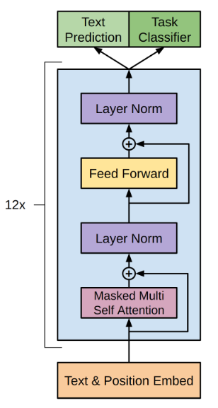

# GPT1.0

- [GPT1.0](#gpt10)
  - [Overview](#overview)
  - [Architecture](#architecture)
  - [Framework](#framework)
    - [Unsupervised pre-training](#unsupervised-pre-training)
    - [Supervised fine-tuning](#supervised-fine-tuning)
    - [Input Representation](#input-representation)
  - [Experiment](#experiment)
    - [Unsupervised pre-training](#unsupervised-pre-training-1)
  - [Reference](#reference)

## Overview

Title is "Improving Language Understanding by Generative Pre-Training" means that tasks can be realized by **generative pre-training** of a **language model** on a diverse corpus of **unlabeled text**, followed by discriminative fine-tuning on each specific task. This approach called **semi-supervised** approach.

## Architecture

The model architecture is basing on Transformer decoder instead of RNN cause Transformer coudl handle long-term context and structured memory, and task-specific input adaptations.

## Framework

### Unsupervised pre-training

GPT use a standard language modeling objective to maximize the following likelihood means the using k words (words in window size) to predict the next word $u_i$

$$
L_1(U) = \sum_i logP(u_i|u_{i-k},...,u_{i-1};\vartheta)
$$

- k: size of the context window
- P: the conditional probability P is modeled using nerual network with parameters $\vartheta$
- $\vartheta$: model parameters

### Supervised fine-tuning

For fine-tuning, using a labeled dataset C, where each instance consists of a sequence of input tokens, $x^1,...,x^m$, along with a label y. The inputs are passed through our pre-trained model to obtain the final transformer block's activation $h_l^m$, which is then fed into an added linear output layer with parameters $W_y$ to predict y:

$$
P(y|x^1,...,x^m) = softmax(h_l^mW_y)
$$

This gives us the following objective to maximize:

$$
L_2(C) = \sum_{(x,y)}log P(y|x^1,...,x^m)
$$

With the pre-training objective(next word prediction is kept during fine-tuning):

$$
L_3(C) = L_2(C) + \lambda * L_1(C)
$$

### Input Representation

Different task has different input representation.

## Experiment

### Unsupervised pre-training

BooksCorpus dataset for training the language model. 7000 unique unpublished books.(5G)

- Transformer decoder with 12 layers
- 768 dim hidden states, 3072 dim feed forward hidden layers
- BPE with 40000 merges

## Reference

- [GPT1.0 Paper](https://www.cs.ubc.ca/~amuham01/LING530/papers/radford2018improving.pdf)
- [GPT，GPT-2，GPT-3 论文精读【论文精读】by 李沐](https://www.bilibili.com/video/BV1AF411b7xQ/?share_source=copy_web&vd_source=3157022a9ba8a59e9a2cac56650df970)
- [【機器學習2021】自督導式學習 (Self-supervised Learning) (四) – GPT的野望 by Hung-yi Lee](https://youtu.be/WY_E0Sd4K80?si=ecqVkFfm40KLriAG)
- [台大資訊 深度學習之應用 | ADL 14.1: Model Pre-Training 預訓練模型介紹 (GPT, GPT-2) by 
陳縕儂](https://youtu.be/ZQ9b-1ZAT8M?si=_u80sLj9Szb2qU_z)