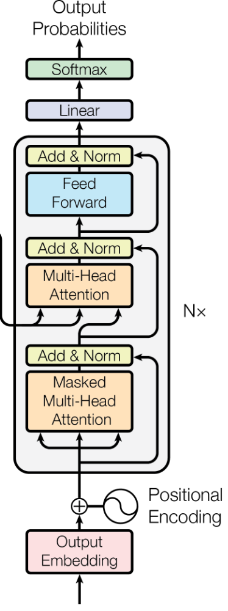

# Transformer

- [Transformer](#transformer)
  - [Architecture](#architecture)
  - [Input](#input)
  - [Encoder](#encoder)
    - [Self-Attention](#self-attention)
      - [Formula](#formula)
      - [Matrix Calculation of Self-Attention](#matrix-calculation-of-self-attention)
    - [Multi-head Attention](#multi-head-attention)
  - [Decoder](#decoder)
    - [Masked Multi-head Attention](#masked-multi-head-attention)
    - [Multi-head Attention](#multi-head-attention-1)
  - [Output](#output)
  - [Multi30k Dataset](#multi30k-dataset)
  - [Resources](#resources)

## Architecture

## Input

Token Embedding + Segment Embedding + Position Embedding

- Token Embedding: nn.Embedding
- Position Encoding: sin/cos position encoding
  - 
    - pos: absolute position index
    - i: from 0 to embedding length, like (0, 512) if we want 512 embedding length for the token
    - 2i: odd position in embedding, this value is calculated from sin
    - 2i+1: even position in embedding, this value is calculated from cos
  - this way ensures different value for each token between 1 and -1
  - 10000 ** (2 * i / d_model): 2i ranges (0, d_model, 2step), means the frequency downs from 1 to 1/10000
  - 
    - This figure is an real example of position encoding for 60 words(rows) with an embedding size of 512(columns). The sin and cos signals are interweaving.

## Encoder

- N encoders
- tow sub-layers in each encoder
- first sub-layer consists of a multi-head attention sub-layer and normalization layer with a residual connection
- second sub-layer consists of a feed forward layer and normalization layer with a residual connection

### Self-Attention

#### Formula
$$
Attention(Q_{n\times{d_k}}, K_{n\times{d_k}}, V_{n\times{d_v}}) = softmax(\frac{Q_{n\times{d_k}}K_{d_k\times{n}}^T}{\sqrt{d_k}}) V_{n\times{d_v}} = Attention_{n\times{n}}V_{n\times{d_v}} = O_{n\times{d_v}}
$$

Q, K, V means Query vector, Key vector and Value Vector. These vectors are created by multiplying the embedding by three matrices $W^Q$, $W^K$, $W^V$ that we trained during the training process. The dimension of Q, K, V is smaller than embedding vector, for example, the embedding dim is 512 and we want the vector dimension is 64 so that the dimension of matrices is (512, 64).

$d_k$ is the Q, K, V dimension, 64. The reason for dividing the score by $\sqrt{d_k}$ is leading to having more stable gradients.

#### Matrix Calculation of Self-Attention

The calculation is done in matrix form for faster processing.

Each row in X means a word in input sequence. X's shape is (num words, 512), W's shape is (512, 64) so the Q, K, V's shape is (num words, 64).

### Multi-head Attention

Multi-headed attention aims to get different features and get different representation.

The multi-headed attention calculation process. It omits embedding dimension, only has batchsize and sequense length dimension for input so that X is tow dimension tensor. In the picture, X shape is (2, 4) but actually it is (2, 4, 512).

## Decoder

- Decoder generates output one by one
- N decoders
- three sub-layer in each decoder
- first sub-layer consists of a **masked** multi-head attention sub-layer and normalization layer with a residual connection
- second sub-layer consists of a multi-head attention sub-layer and normalization layer with a residual connection. The key and value are come from encoder output. The query is coming from first layer of decoder
- third sub-layer consists of a feed forward layer and normalization layer with a residual connection

### Masked Multi-head Attention

$$
Attention(Q_{n\times{d_k}}, K_{n\times{d_k}}, V_{n\times{d_v}}) = mask(softmax(\frac{Q_{n\times{d_k}}K_{d_k\times{n}}^T}{\sqrt{d_k}})) V_{n\times{d_v}} = mask(Attention_{n\times{n}})V_{n\times{d_v}} = O_{n\times{d_v}}
$$

Mask is only work on scores.

The reason for masking input is that the predictions for position i can depand only on the known outputs at positions less than i.

For output $o_1$, it only depand on input $v_1$. 

For output $o_2$, it only depend on input $v1$ and $v2$.

### Multi-head Attention

It is a normal self-attention. The only difference is that the key and value are come from encoder output. The query is coming from first layer of decoder.

## Output

The output is combined with a linear layer and log_softmax. The input size of the linear layer is d_model, and the output size is vocab_size since we want to predict a word from the target vocabulary. Then, log_softmax calculates the probability for each word.

The reason for using log_softmax instead of normal softmax is that the input values may be so large that they cause the softmax to overflow.

softmax:

$$
softmax(z_i) = \frac{e^{z_i}}{\sum_j{e^{z_j}}}
$$

log_softmax:

$$
log\_softmax(z_i) = log{\frac{e^{z_i - max(z)}}{\sum_j{e^{z_j - max(z)}}}} = (z_i - max(z)) - log(\sum_j{e^{z_j - max(z)}})
$$

When implementing log_softmax, the common way is the second formula since $z_i - max(z)$ maybe is a very small negative number, it will make $e^{z_i - max(z)}$ infinitely close to zero. After log, it will underflow.

## Multi30k Dataset

## Resources

- [Attention Is All You Need](https://arxiv.org/abs/1706.03762)
- [illustrated-transformer](https://jalammar.github.io/illustrated-transformer/)
- [Positional Encoding 的高效实现方式](https://zhuanlan.zhihu.com/p/659897051)